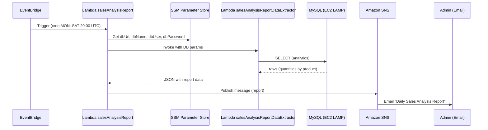

# Working with AWS Lambda — Sales Analysis Report

> **Resumo:** Este laboratório cria uma solução serverless em AWS Lambda que gera e envia por e‑mail um relatório diário de vendas a partir de uma base MySQL hospedada em uma instância EC2 (LAMP). As credenciais do banco ficam no **AWS Systems Manager Parameter Store** e a entrega do relatório é feita via **Amazon SNS**.

---

## Índice

* [Arquitetura](#arquitetura)
* [Objetivos](#objetivos)
* [Duração](#duração)
* [Recursos a serem criados](#recursos-a-serem-criados)
* [Pré‑requisitos](#pré-requisitos)
* [Passo a passo](#passo-a-passo)

  * [1. Revisar funções e papéis do IAM](#1-revisar-funções-e-papéis-do-iam)
  * [2. Criar Layer e função de extração de dados](#2-criar-layer-e-função-de-extração-de-dados)
  * [3. Testar e solucionar problemas](#3-testar-e-solucionar-problemas)
  * [4. Criar o tópico SNS e assinatura](#4-criar-o-tópico-sns-e-assinatura)
  * [5. Criar a função principal e agendar via EventBridge](#5-criar-a-função-principal-e-agendar-via-eventbridge)
* [Cron — exemplos úteis](#cron--exemplos-úteis)
* [Validação e testes](#validação-e-testes)
* [Troubleshooting (erros comuns)](#troubleshooting-erros-comuns)
* [Limpeza (tear‑down)](#limpeza-tear-down)
* [Custos e boas práticas](#custos-e-boas-práticas)

---

## Arquitetura

Fluxo resumido:

1. **EventBridge/CloudWatch Events** aciona `salesAnalysisReport` (seg–sáb às 20:00 UTC).
2. `salesAnalysisReport` busca credenciais no **Parameter Store**.
3. `salesAnalysisReport` invoca `salesAnalysisReportDataExtractor`.
4. `salesAnalysisReportDataExtractor` consulta o MySQL do **EC2 (LAMP)** via **PyMySQL**.
5. `salesAnalysisReport` formata o relatório e publica no **SNS Topic**.
6. **SNS** envia o e‑mail ao administrador.



---

## Objetivos

* Identificar permissões **IAM** necessárias para Lambda acessar outros serviços.
* Criar um **Lambda Layer** para dependências externas (PyMySQL).
* Implementar funções Lambda para **extrair dados** e **enviar relatórios**.
* **Agendar** execução e **encadear** funções (invoke → data extractor).
* Usar **CloudWatch Logs** para depurar.

## Duração

~ **60 minutos**.

---

## Recursos a serem criados

* **IAM Roles**

  * `salesAnalysisReportRole`

    * Políticas: `AmazonSNSFullAccess`, `AmazonSSMReadOnlyAccess`, `AWSLambdaBasicRunRole`, `AWSLambdaRole` (invocar outra Lambda)
  * `salesAnalysisReportDERole`

    * Políticas: `AWSLambdaBasicRunRole`, `AWSLambdaVPCAccessRunRole`
* **Lambda Layer**: `pymysqlLibrary` (PyMySQL)
* **Funções Lambda**

  * `salesAnalysisReportDataExtractor` (Python 3.9) — handler `salesAnalysisReportDataExtractor.lambda_handler`
  * `salesAnalysisReport` (Python 3.9) — handler `salesAnalysisReport.lambda_handler`
* **Parameter Store (SSM)**: `/cafe/dbUrl`, `/cafe/dbName`, `/cafe/dbUser`, `/cafe/dbPassword`
* **VPC/Subnets/Security Group**: acesso ao MySQL (porta **3306**) da instância EC2
* **Amazon SNS**: Topic `salesAnalysisReportTopic` (display name `SARTopic`) + assinatura por **Email**
* **EventBridge (CloudWatch Events)**: regra `salesAnalysisReportDailyTrigger`

---

## Pré‑requisitos

* Acesso ao **AWS Management Console** e permissões para IAM, Lambda, SSM, SNS, EC2 e EventBridge.
* Arquivos locais:

  * `pymysql-v3.zip` (conteúdo de layer)
  * `salesAnalysisReportDataExtractor-v3.zip` (código da função de extração)
  * `salesAnalysisReport-v2.zip` (código da função principal)
* Banco MySQL ativo em EC2 (LAMP) e parâmetros criados no Parameter Store.

---

## Passo a passo

### 1. Revisar funções e papéis do IAM

1. **IAM → Roles →** `salesAnalysisReportRole`

   * *Trust relationship*: `lambda.amazonaws.com`
   * *Permissions*: `AmazonSNSFullAccess`, `AmazonSSMReadOnlyAccess`, `AWSLambdaBasicRunRole`, `AWSLambdaRole`
2. **IAM → Roles →** `salesAnalysisReportDERole`

   * *Trust relationship*: `lambda.amazonaws.com`
   * *Permissions*: `AWSLambdaBasicRunRole`, `AWSLambdaVPCAccessRunRole`

### 2. Criar Layer e função de extração de dados

**2.1 Lambda Layer**

* **Lambda → Layers → Create layer**

  * *Name*: `pymysqlLibrary`
  * *Description*: `PyMySQL library modules`
  * *Upload*: `pymysql-v3.zip`
  * *Compatible runtimes*: `Python 3.9`

> Observação: o zip de layers deve obedecer à estrutura de diretórios do Lambda (ex.: pastas em `python/`).

**2.2 Função `salesAnalysisReportDataExtractor`**

* **Lambda → Create function → Author from scratch**

  * *Function name*: `salesAnalysisReportDataExtractor`
  * *Runtime*: `Python 3.9`
  * *Execution role*: **Use an existing role** → `salesAnalysisReportDERole`

**2.3 Anexar o Layer**

* **Function overview → Layers → Add a layer**

  * *Custom layers*: `pymysqlLibrary` (Version `1`)

**2.4 Subir código e ajustar handler**

* **Runtime settings → Edit** → *Handler*: `salesAnalysisReportDataExtractor.lambda_handler`
* **Code source → Upload from → .zip file** → `salesAnalysisReportDataExtractor-v3.zip`

**2.5 Configurar rede (VPC)**

* **Configuration → VPC → Edit**

  * *VPC*: `Cafe VPC`
  * *Subnets*: `Cafe Public Subnet 1`
  * *Security groups*: `CafeSecurityGroup`
  * Garanta **porta 3306** liberada para o destino (MySQL)

### 3. Testar e solucionar problemas

**3.1 Obter parâmetros do SSM**

* **Systems Manager → Parameter Store**

  * Copie os valores de: `/cafe/dbUrl`, `/cafe/dbName`, `/cafe/dbUser`, `/cafe/dbPassword`

**3.2 Evento de teste (Lambda → Test)**

```json
{
  "dbUrl": "<valor de /cafe/dbUrl>",
  "dbName": "<valor de /cafe/dbName>",
  "dbUser": "<valor de /cafe/dbUser>",
  "dbPassword": "<valor de /cafe/dbPassword>"
}
```

* Se ocorrer **timeout (3s)**, verifique:

  * Regras do **Security Group** (porta **3306**)
  * Conectividade em VPC/Subnet
  * Aumente `Timeout` em **Configuration → General configuration** se necessário

**3.3 Popular dados (site do café)**

* Acesse `http://<CafePublicIP>/cafe`, faça pedidos em **Menu** e teste novamente.
* Resposta esperada (exemplo):

```json
{
  "statusCode": 200,
  "body": [
    {
      "product_group_number": 1,
      "product_group_name": "Pastries",
      "product_id": 1,
      "product_name": "Croissant",
      "quantity": 1
    }
  ]
}
```

### 4. Criar o tópico SNS e assinatura

**4.1 SNS Topic**

* **SNS → Topics → Create topic**

  * *Type*: `Standard`
  * *Name*: `salesAnalysisReportTopic`
  * *Display name*: `SARTopic`
  * Guarde o **ARN** do tópico

**4.2 Subscription**

* **Create subscription**

  * *Protocol*: `Email`
  * *Endpoint*: seu e‑mail
  * Confirme a assinatura no e‑mail recebido (status: **Confirmed**)

### 5. Criar a função principal e agendar via EventBridge

**5.1 Conectar ao CLI Host (EC2 Instance Connect)**

* **EC2 → Instances → CLI Host → Connect**

**5.2 Configurar AWS CLI**

```bash
aws configure
# AWS Access Key ID: <AccessKey>
# AWS Secret Access Key: <SecretKey>
# Default region name: us-west-2
# Default output format: json
```

**5.3 Criar a função `salesAnalysisReport` (CLI)**

* Obtenha o **ARN** de `salesAnalysisReportRole` no IAM.

```bash
cd activity-files
ls

aws lambda create-function \
  --function-name salesAnalysisReport \
  --runtime python3.9 \
  --zip-file fileb://salesAnalysisReport-v2.zip \
  --handler salesAnalysisReport.lambda_handler \
  --region us-west-2 \
  --role <salesAnalysisReportRoleARN>
```

**5.4 Variáveis de ambiente**

* **Lambda → Functions → salesAnalysisReport → Configuration → Environment variables → Edit**

  * *Key*: `topicARN`
  * *Value*: `<ARN do salesAnalysisReportTopic>`

**5.5 Teste da função**

* **Test → Create new event** (template `hello-world`, sem payload especial) → **Test**
* Saída esperada:

```json
{
  "statusCode": 200,
  "body": "\"Sale Analysis Report sent.\""
}
```

* Verifique o e‑mail com assunto **Daily Sales Analysis Report**

**5.6 Adicionar trigger (EventBridge/CloudWatch Events)**

* **Function overview → Add trigger → EventBridge (CloudWatch Events)**

  * *Rule*: **Create a new rule**
  * *Rule name*: `salesAnalysisReportDailyTrigger`
  * *Rule description*: `Initiates report generation on a daily basis`
  * *Rule type*: `Schedule expression`
  * *Schedule expression (teste, +5 min)*: conforme sua hora/UTC
  * **Produção (seg–sáb às 20:00 UTC)**:

```text
cron(0 20 ? * MON-SAT *)
```

---

## Cron — exemplos úteis

* **Seg–Sáb às 20:00 UTC**: `cron(0 20 ? * MON-SAT *)`
* **Todos os dias às 08:00 UTC**: `cron(0 8 * * ? *)`
* **A cada 15 minutos**: `rate(15 minutes)`

> Dica: as expressões do EventBridge usam **UTC**.

---

## Validação e testes

* **Lambda Logs**: CloudWatch Logs → verifique `START`, `END`, `REPORT`
* **DataExtractor** retorna `statusCode: 200` e `body` com quantidades
* **salesAnalysisReport** publica no SNS e e‑mail é recebido
* **Testes adicionais**: faça novos pedidos no site e reexecute a função

---

## Troubleshooting (erros comuns)

* **Timeout (3s)** ao testar o extractor

  * Aumente o `Timeout` (p.ex., 10–30s)
  * Confirme **porta 3306** no Security Group
  * Verifique Subnet/VPC e **AWSLambdaVPCAccessRunRole**
* **Falha ao publicar no SNS**

  * Cheque variável `topicARN`
  * Permissão `AmazonSNSFullAccess` em `salesAnalysisReportRole`
* **Sem dados no relatório**

  * Popular base via site do café (pedidos)
  * Conferir query e conexão ao DB
* **Assinatura SNS pendente**

  * Reenviar e confirmar e‑mail de subscription

---

## Limpeza (tear‑down)

Para evitar custos:

1. **EventBridge**: desative/exclua a regra `salesAnalysisReportDailyTrigger`.
2. **Lambda**: exclua `salesAnalysisReport` e `salesAnalysisReportDataExtractor`.
3. **Layers**: exclua o `pymysqlLibrary` (se não for reutilizar).
4. **SNS**: remova assinaturas e exclua `salesAnalysisReportTopic`.
5. **SSM Parameters**: remova `/cafe/*` se não forem necessários.
6. **EC2/SG/Subnets**: desligue/termine recursos do ambiente de laboratório.

---

## Custos e boas práticas

* **Custos**: Lambda (invocações e duração), SNS (entregas), EC2 (instância LAMP), Logs (CloudWatch). Monitore com **AWS Cost Explorer**.
* **Boas práticas**:

  * Configure **Timeout**, **Memory** e **Concurrency** conforme a carga.
  * Armazene **segredos** no Parameter Store (idealmente com criptografia KMS).
  * Use **Layers** para dependências comuns e versionamento.
  * Acompanhe métricas com **CloudWatch Alarms**.
  * Estruture logs (JSON) para facilitar troubleshooting.

---

### Referências rápidas

* **Handlers**

  * Extractor: `salesAnalysisReportDataExtractor.lambda_handler`
  * Principal: `salesAnalysisReport.lambda_handler`
* **Variável de ambiente**

  * `topicARN = <ARN do SNS>`
* **Parâmetros SSM**

  * `/cafe/dbUrl`, `/cafe/dbName`, `/cafe/dbUser`, `/cafe/dbPassword`
* **Porta MySQL**

  * `3306`

> **Status:** README pronto para uso em repositório. Copie este arquivo como `README.md` na raiz do projeto.
